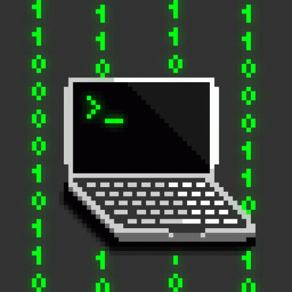

###

<h1 align="left"><code>$ whoami</code></h1>

###

👋 Hi, I’m @rohit-sundar, an undergrad student at Amrita Vishwa Vidyapeetham, Coimbatore.

###

<h2 align="left"><code>$ cat about.txt</code></h2>

###

###

👀 Interested in cybersecurity, offensive security, exploit development, operating systems, computer networking, artificial intelligence, and much more!

🌱 Currently into binary exploitation, reverse engineering and web security.  🤖 Working on LLM security, generative AI, and agentic AI security.

🏴 I also play CTFs occasionally.

⚔️ Aspiring red teamer focused on finding bugs, zero-day vulnerabilities, developing exploits, and emulating adversaries.

🤝 Always open to collaborating and learning from the community!

###

<h2 align="left"><code>$ ls -la ~/skills</code></h2>

###

<h3 align="left"><code>drwxr-xr-x  languages/</code></h3>

  
  
  
  
  
  
  
  
  
  
  
  
  
  
  

<h3 align="left"><code>drwxr-xr-x  penetration_testing/</code></h3>

<h3 align="left"><code>drwxr-xr-x  web_security/</code></h3>

<h3 align="left"><code>drwxr-xr-x  ai_security/</code></h3>

<h3 align="left"><code>drwxr-xr-x  reverse_engineering/</code></h3>

<h3 align="left"><code>drwxr-xr-x  binary_exploitation/</code></h3>

###

<h2 align="left"><code>$ ./connect.sh</code></h2>

###

###

`"The quieter you become, the more you are able to hear."`

<!---
rohit-sundar/rohit-sundar is a ✨ special ✨ repository because its `README.md` (this file) appears on your GitHub profile.
You can click the Preview link to take a look at your changes.
--->
